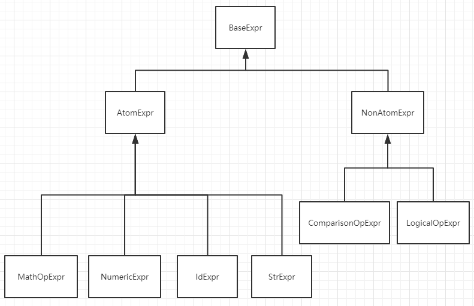

# Introduction

> This project is front end part of database-miniDB for the course software engineering

### Processing flow

- input (from vm)

  - accept a whole string of sql statement ( excluding ';' )

- lexer

  - turn the string into tokens sequence according to word-formation rules
  - tokens include keyword, identifier, numeric(int), string_literal
  - if unexcepted char occurs, throw an exception

- parse (generated by `RulesTranslator` using .tsl file)

  - accept token one by one, shift / reduce using LR1
  - syntax-directed translation, generate query plan bottom-up
  - for expression and select operation, generate ast
  - when generate query plan, check if any invalid operation occurs

- output (to vm)

  - if the statement is valid, return query plan struct

  - if it's exit statement, return exit

  - otherwise error msg

    

#### Other parts of the database
- https://github.com/rsy56640/xjbDB
- https://github.com/ssyram/NovelRulesTranslator

#### documents and references

- https://www.youtube.com/playlist?list=PLSE8ODhjZXjYutVzTeAds8xUt1rcmyT7x

- https://www.bilibili.com/video/av39731185
- https://github.com/pingcap/tidb/tree/master/util/ranger
- http://tatiyants.com/postgres-query-plan-visualization/
- https://docs.faircom.com/doc/SQLExplorer/37578.htm


# Implementation

### miniSQL syntax

> the sql syntax is a subset of mySQL with some **modifications**

**change**

- all **keywords** are **uppercase**, which means miniSQL is case-sensitive
- only have `INT` `CHAR(n)` `VARCHAR(n)` data type

- the **wildcard** is `$` instead of `*`
- the keyword for **primary key** is `PK` instead of `PRIMARY KEY`
- the keyword for **not null** is `NN` instead of `NOT NULL`
- the **assignment symbol** `=` is only used for update set , while the **equality symbol** `==` is widely used in the where clause
- remove some optional keywords and clauses

**new** 

- support `_` in number, such as `1_000_000`  and `66_1234_0000`
- support expression in many part
  - `SELECT id + 1, "name:" + name FROM...`
  - `UPDATEXX SET name = "ID-" + name ...`
  - `INSERTXX (id, name) VALUES (1+4/2%3, "hua" + "ji")`
  - `... ORDERBY id % 10 DESC`

```
sqlStatement := ddlStatement | dmlStatement

ddlStatement := createTable | dropTable
dmlStatement := selectStatement | insertStatement | updateStatement | deleteStatement

createTable := "CREATE" "TABLE" tableName createDefinitions
dropTable := "DROP" "TABLE" tableName

createDefinitions := "(" createDefinition [{"," createDefinition}*] ")"
createDefinition := "ID" dataType [columnConstraint*]
dataType := "INT" | "CHAR" "(" positiveNum ")" | "VARCHAR" "(" positiveNum ")"
columnConstraint := "NOT_NULL" | "DEFAULT" expressionAtom | "PRIMARY_KEY" | "REFERENCES" tableName

insertStatement := "INSERT" tableName insertElements 
	| "INSERT" tableName "(" "ID" [{"," "ID"}*] ")" insertElements
insertElements := "VALUES" "(" expressionAtom [{"," expressionAtom}*] ")"

updateStatement := "UPDATE" tableName "SET" updateElements ["WHERE" expression]
updateElements := updateElement [{"," updateElement}*]
updateElement := columnName "=" expressionAtom

deleteStatement := "DELETE" "FROM" tableName ["WHERE" expression]

selectStatement := "SELECT" selectElements fromClause ["WHERE" expression] [orderByClause]
selectElements := "$" | expressionAtom [{"," expressionAtom}*]
fromClause := "FROM" tableName [{"," tableName}*] 
	| "FROM" tableName "JOIN" tableName
orderByClause := "ORDERBY" orderByExpression [{"," orderByExpression}*]
orderByExpression := expressionAtom ["ASC"|"DESC"]

expression := expression logicalOperator expression | predicate
predicate := expressionAtom comparisonOperator expressionAtom | expressionAtom
expressionAtom  := expressionAtom mathOperator expressionAtom | constantNum | "STR_LITERAL" | columnName

logicalOperator := "AND" | "OR"
comparisonOperator := "==" | ">" | "<" | "<=" | ">=" | "!="
mathOperator := "*" | "/" | "%" | "+" | "-"


tableName := "ID"
columnName := "ID" "." "ID" | "ID"
constantNum := ["-"] positiveNum
positiveNum := "NUMBER_CONSTANT"
```

```
CREATE TABLE USER(id INT PK, name VARCHAR(20) NN)

SELECT $ FROM USER

SELECT id + 1, "NAME:" + name FROM USER JOIN CLASS WHERE CLASS.no > 666 AND USER.id * USER.id > 3 + USER.id AND USER.name == CLASS.name + 'huaji'

INSERT USER(id,name) VALUES(123 * 6 + 233, "huaji" + "666")

UPDATE USER SET name = "huawei" + USER.id WHERE id == 1_2_3

DELETE FROM USER WHERE id == 123

DROP TABLE USER
```


### Dependency relationship


### AST

**expression AST**



**operation AST**


### visit functions

> utility functions for specific purposes

**output visit**

output the AST to the given ostream regardless of validity

```cpp
void outputVisit(const BaseExpr* root, std::ostream &os);

void outputVisit(const BaseOp* root, std::ostream &os);
```

**check visit**

check visit, used in parsing phase

1. check sql semantics,
   such as `TableA.idd == 123` but here doesn't exist `idd` column in `TableA`

2. check the type matching,

   such as `WHERE "wtf" AND TableA.name == 123`
   *		here string `"wtf"` is not supported by logicalOp `AND`
   *		string `TableA.name` and number `123` don't matched

for any mismatching, throw DB_Exception
if passing, it is guaranteed other visit function will never encounter unexcepted cases

```cpp
void checkVisit(const BaseExpr* root, const std::string tableName = std::string());

void checkVisit(const AtomExpr* root, const std::string tableName = std::string());
```

**vm visit**

used to calculate the real value for a specified expression

```cpp
//for WHERE clause(expression), used for filtering values of a row
bool vmVisit(const BaseExpr* root, const table::Row* row);

//for others(expressionAtom), used for computing math/string expression and data in the specified row
RetValue vmVisit(const AtomExpr* root, const table::Row* row = nullptr);
```


# Issues

### todo

- createinfo print
- all check visit case 
- check pk nums
- tsl delay check till know tablename
- RetValue need bool?
- //(shelved till check optization)check CHAR and VARCHAR length according to table structure(sometimes cannot check)


### Expansibility

- source of DML op structs should be a class, such as singleTableSource ExprTableSource、JoinTableSource、SubqueryTableSource


### optimization

- optimize expression structure when check visiting


### multi-threading (shelved)

- buffer for table structure needs read&write lock
- among simultaneous execution plans, one drops a table which another plan used it (may pass semantics check)


# Requirements

> requirements need supporting by other parts

- xx
